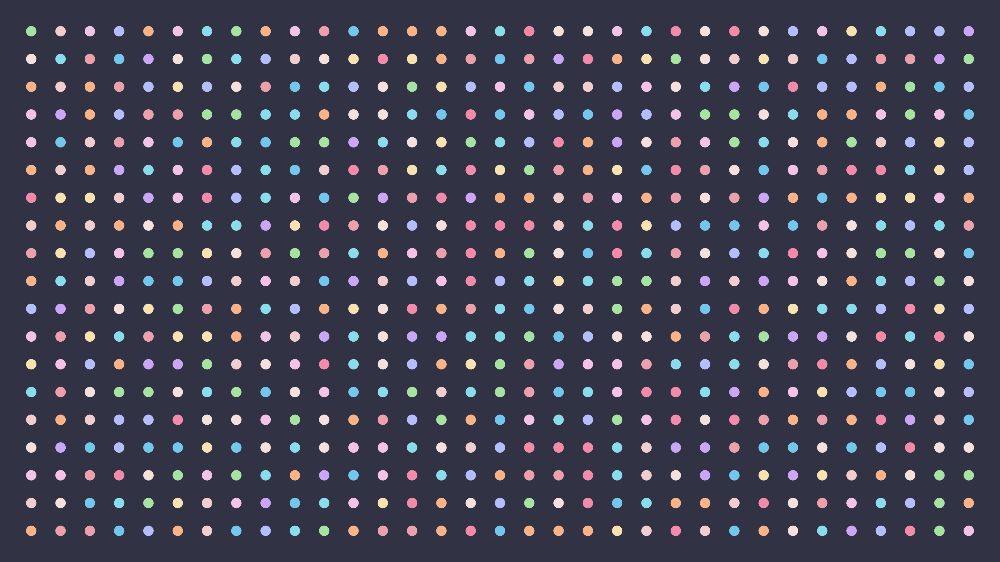
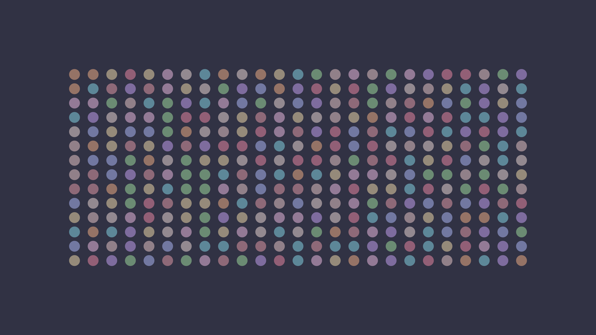
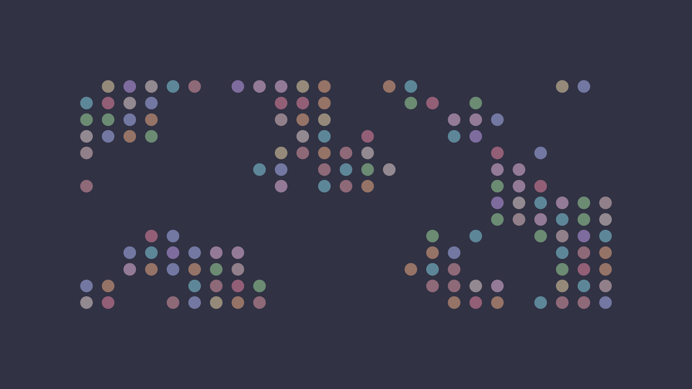
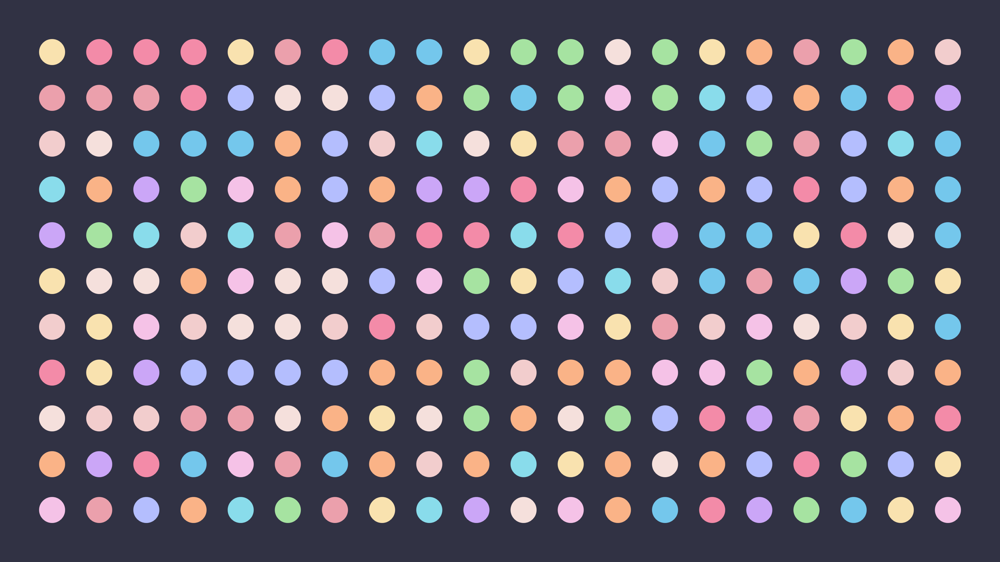
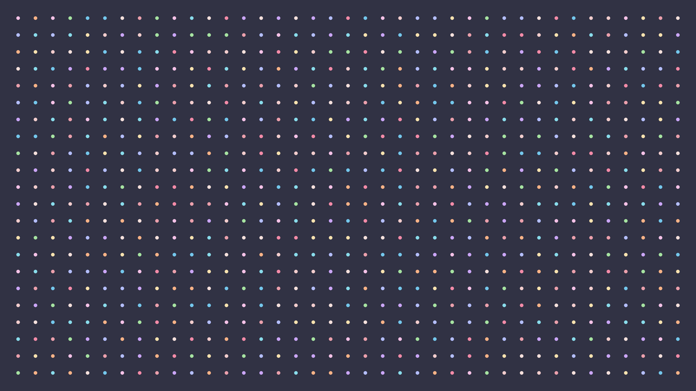

# 🟣 dots wallpaper

A minimal wallpaper pack featuring soft dot grids, inspired by the [Catppuccin Mocha](https://github.com/catppuccin/catppuccin) colour palette.

  

  
  
  
  

- 🟠 Soft Catppuccin colorschemes to match your workflow
- ⚪ Minimalist dot-grid composition with variations (download the folder and set your desktop to automatically change wallpaper)
- 🟣 Includes both landscape and portrait formats for dual-screen setups, focus-modes, and clean desktops!

---

All wallpapers are **1920×1080** ([landscape/](./landscape/)) and **1080×1920** ([portrait/](./portrait/)), with subtle variation in spacing and composition.

Made with [p5.js](https://p5js.org/): [`/sketch/sketch.js`](./sketch/sketch.js)

Preview or remix the sketch 'live' via [p5.js editor](https://editor.p5js.org/thrly/sketches/UA0hQ_Bmz)

---

## Want more?

I also made: 🧊 [cubes-wallpaper](https://github.com/thrly/cubes-wallpaper) – 3D stacking cube wallpapers with Catppuccin colourscheme

made with 🧡 and cats
